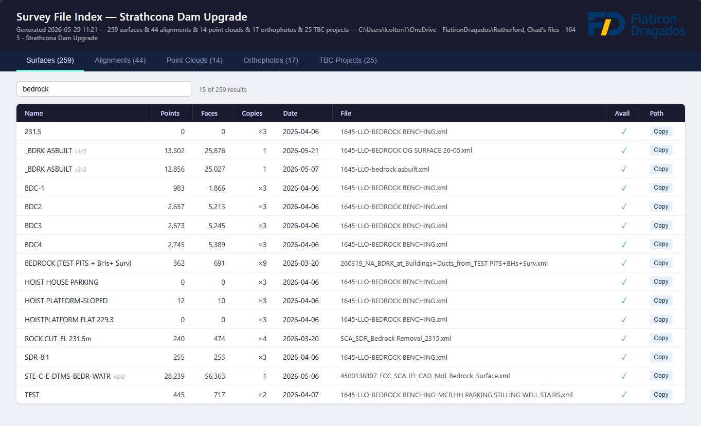
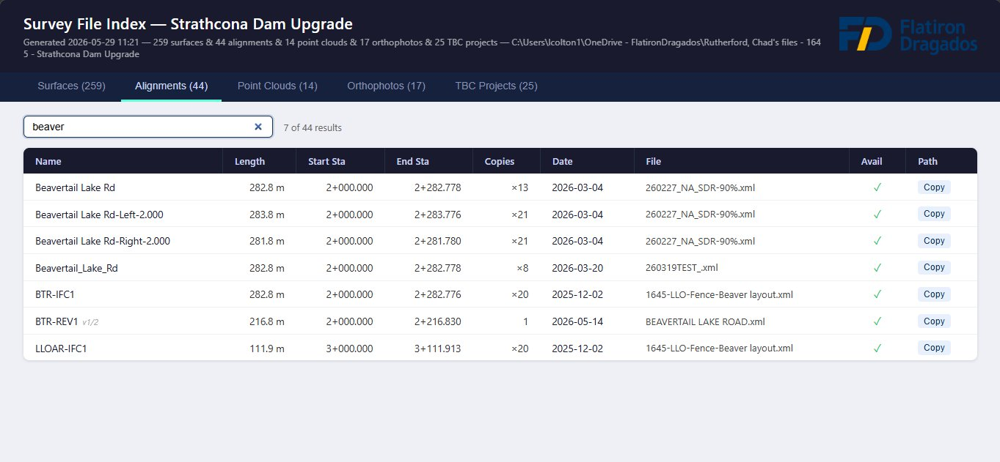
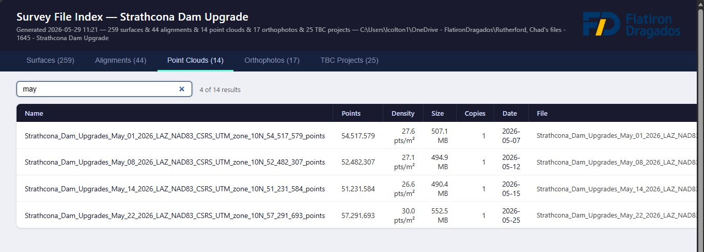
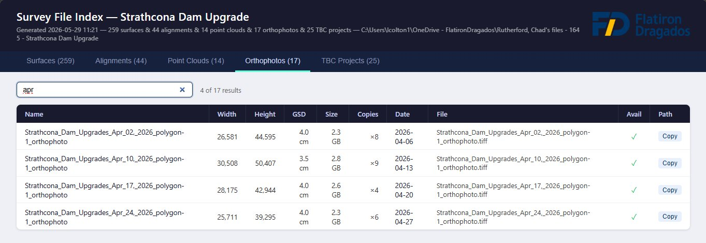
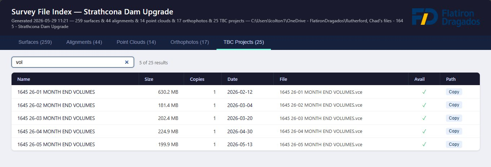

# LandXML Survey Index

Indexes geospatial survey files in a project folder and produces a self-contained, sortable, pageable HTML report. Point it at any directory tree containing survey data and it produces a single `index.html` you can open in any browser or share with your team.

## Screenshots

**Surfaces** — 259 LandXML surfaces with point/face counts, version tracking, and live filter



**Alignments** — length, start/end station in chainage format (e.g. `2+000.000`)



**Point Clouds** — point count and density (pts/m²) read directly from LAS/LAZ headers



**Orthophotos** — pixel dimensions and GSD extracted from GeoTIFF tags



**TBC Projects** — Trimble Business Center `.vce` files with size and date



## File types indexed

| Tab | Extension | Metadata extracted |
|---|---|---|
| Surfaces | `.xml` (LandXML) | Surface name, point count, face count, version |
| Alignments | `.xml` (LandXML) | Alignment name, length, start/end station |
| Point Clouds | `.laz` / `.las` | Point count, density (pts/m²) |
| Orthophotos | `.tif` / `.tiff` | Dimensions, GSD — supports classic TIFF, BigTIFF, GeoTIFF |
| TBC Projects | `.vce` | File size and date |

All tabs show: date modified, filename, cloud/local availability (✓ / ☁), and a **Copy Path** button.

## Requirements

- Python 3.11+ — run via `uv run` (recommended) or plain `python`
- [Everything by voidtools](https://www.voidtools.com/) *(optional but recommended)* — enables fast indexed search instead of a directory walk. Enable its HTTP server under **Tools → Options → HTTP Server**.

No third-party Python packages required.

## Usage

```powershell
# Index all file types → index.html written into the search directory
uv run survey_index.py --path "C:\Projects\MyProject" --batch

# LandXML surfaces only
uv run survey_index.py --path "C:\Projects\MyProject"

# Custom title and output location
uv run survey_index.py --path "C:\Projects\MyProject" --batch --title "Strathcona Dam Upgrade" --output-file "D:\Reports\index.html"

# Add a logo (PNG embedded in the report)
uv run survey_index.py --path "C:\Projects\MyProject" --batch --logo "C:\logo.png"

# Sort by largest file first
uv run survey_index.py --path "C:\Projects\MyProject" --batch --sort size

# Plain text output
uv run survey_index.py --path "C:\Projects\MyProject" --output txt
```

### All options

| Flag | Default | Description |
|---|---|---|
| `--path DIR` | *(required)* | Root directory to search |
| `--title TEXT` | `Survey File Index` | Report title shown in the header |
| `--output-file FILE` | `<path>/index.html` | Override the HTML output path |
| `--logo FILE` | *(none)* | PNG logo to embed in the report header |
| `--everything-url URL` | `http://localhost` | Everything HTTP server URL |
| `--batch` | off | Index all file types (default: surfaces only) |
| `--mode surfaces\|alignments` | `surfaces` | Element type when not using `--batch` |
| `--sort name\|date\|size` | `name` | Initial sort order |
| `--output html\|txt` | `html` | Output format |
| `--prefer-path FRAGMENT` | *(repeatable)* | Prepend a folder fragment to the path-priority list |
| `--no-hash-dedup` | off | Disable file-level hash deduplication |
| `--no-content-dedup` | off | Disable geometry-level deduplication (LandXML only) |

## Deduplication

Duplicate files are automatically collapsed:

- **Hash dedup** — files with identical content (MD5 of first 64 KB) are merged into one row showing a ×N copies count.
- **Path priority** — when choosing which copy to show, folders are preferred in this order: `02-DESIGN` → `03-ASBUILTS` → `05-QC SURVEY DATA` → `07-DATALOGGER BACKUP` → `01-OUTPUT` → `06-WORKING DATA\TBC` → `06-WORKING DATA`. Override with `--prefer-path FRAGMENT`.
- **Content dedup** (LandXML only) — surfaces/alignments with the same name and geometry counts across different files are merged. Different versions (differing point/face counts) are kept as separate rows labelled `v1/2`, `v2/2`, etc.

## Scheduled indexing

Edit `SEARCH_PATH` and `TITLE` in `run_index.bat`, then register it as a Windows scheduled task:

```bat
:: Run weekly on Monday at 7am (run once as admin)
schtasks /create /tn "Survey Index" /tr "C:\Projects\landxml-survey-index\run_index.bat" /sc weekly /d MON /st 07:00 /f

:: Run immediately
schtasks /run /tn "Survey Index"

:: Remove
schtasks /delete /tn "Survey Index" /f
```
